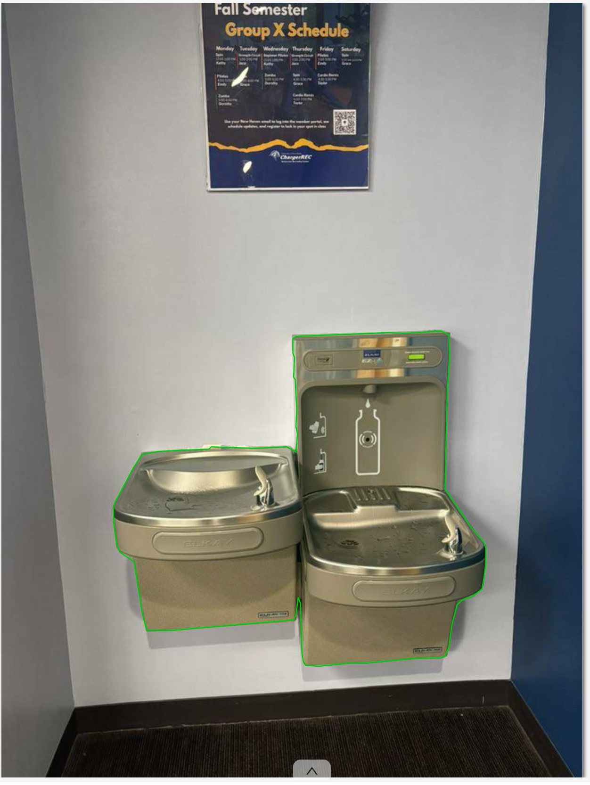
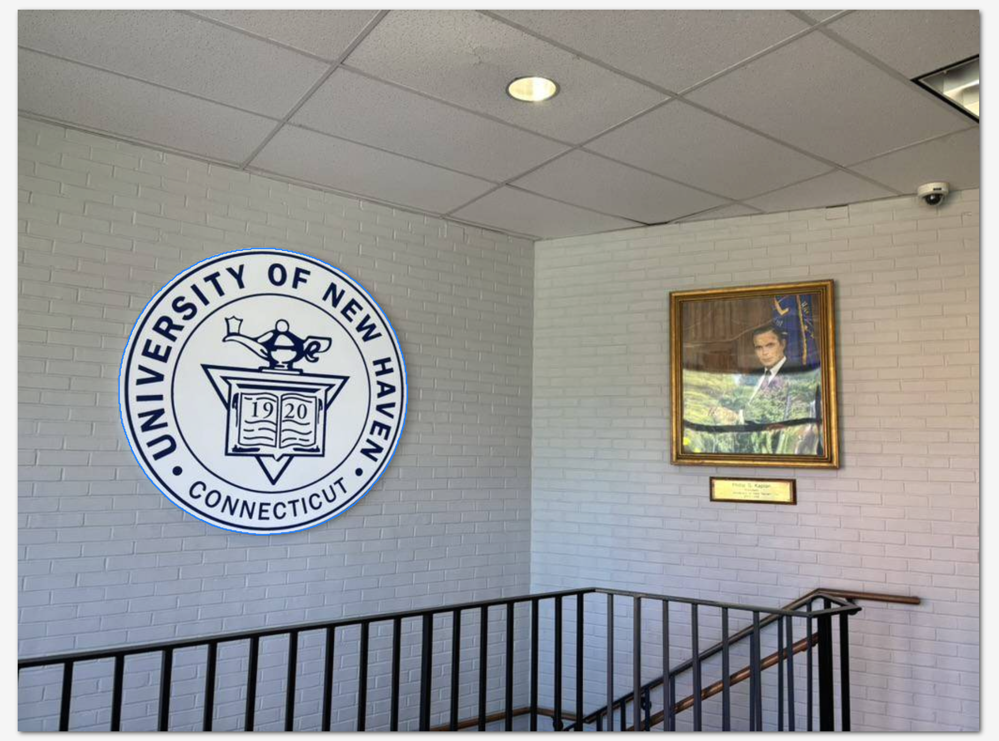
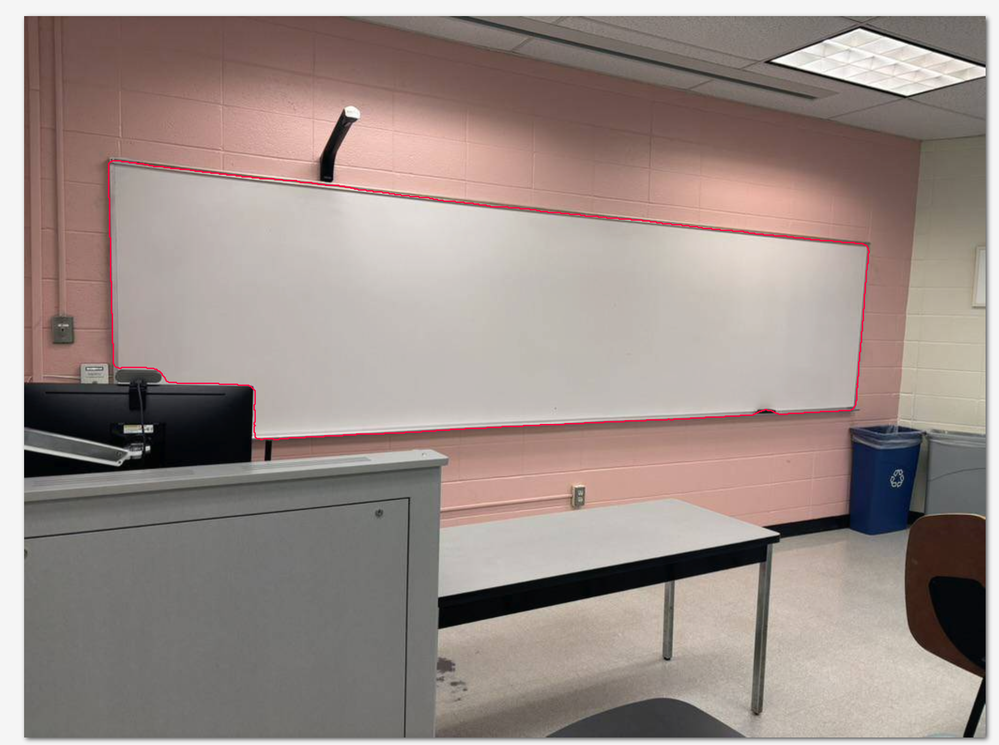

# Deep Learning Project Proposal

## YOLACT++: Real-time Instance Segmentation on Campus Objects

---

## Contact Information

**Student:** Jingming Liu
**Course:** DeepLearning DSCI-6011-01
**Instructor:** Muhammad Aminul Islam

---

## 1. Task Description

### Selected Task
**Instance Segmentation**

### What is Instance Segmentation?

Instance segmentation is an advanced computer vision task that combines object detection and semantic segmentation. Unlike object detection which only provides bounding boxes around objects, or semantic segmentation which classifies each pixel but doesn't distinguish between individual objects of the same class, instance segmentation identifies each distinct object instance in an image and creates a precise pixel-level mask for each one.

For example, if an image contains three people, instance segmentation will:
1. Detect all three people individually
2. Create separate masks for each person
3. Assign unique instance IDs to differentiate them

---

## 2. Selected Model and Paper

### Paper Titles
1. **YOLACT: Real-time Instance Segmentation** (ICCV 2019)
2. **YOLACT++: Better Real-time Instance Segmentation** (TPAMI 2020)

### Model Name
**YOLACT++** (You Only Look At CoefficienTs, improved version)

### Paper Links
- YOLACT (ICCV 2019): https://arxiv.org/abs/1904.02689
- YOLACT++ (TPAMI 2020): https://arxiv.org/abs/1912.06218

### Code Repository
https://github.com/dbolya/yolact

### Pre-trained Model Availability
- **Framework:** PyTorch
- **Pre-trained weights:** Yes - Available from official repository
- **Training dataset:** MS COCO 2017 (Common Objects in Context)
- **Original classes:** 80 object categories from COCO dataset

### Transfer Learning Strategy
**Fine-tuning Approach:**
For this project, we will employ a **layer-freezing transfer learning strategy**:

**Frozen Components (retain pre-trained COCO weights):**
- Backbone network (ResNet50/101) - extracts general visual features
- Feature Pyramid Network (FPN) - multi-scale feature representation
- Prototype generation branch - creates mask prototypes
- Mask coefficient prediction layers - predicts how to combine prototypes

**Trainable Component (adapted for campus objects):**

- Final classification layer only - learns to classify 3 new campus object categories.

**Rationale:**
1. Feature Reusability: Low and mid-level features learned on COCO (edges, textures, shapes) generalize well to campus objects
2. Prevents Overfitting: With only 250-300 training images vs COCO's 118K, freezing layers prevents overfitting
3. Efficient Training: Only updating 1-5% of parameters drastically reduces training time and GPU memory

The model will learn to map existing features to our 3 campus object classes while preserving the powerful feature extraction and mask generation capabilities learned from COCO.

---

## 3. Dataset Description

### 3.1 Data Source

**Source Type:** Campus Photography (University Campus - Real-world photographs)

**Why This Source?**
I will collect original photographs from university campus locations. 

**Collection Method:**
- Capture photos using smartphone/digital camera
- Cover different campus locations: **classrooms, outdoor areas**
- Various lighting conditions: **morning, afternoon, indoor/outdoor**
- Multiple angles and distances for each object type
- Capture objects in context with other campus elements
- Ensure **200-300** total images with good representation of each object class

### 3.2 Objects to Detect

**Selected Objects:**

1. **Whiteboard**
2. **Drinking Water Fountain**
3. **University Logo/Signage**

**Why these objects are different from COCO pre-trained classes:**
The COCO dataset (80 classes) includes: person, bicycle, car, chair, laptop, book, backpack, etc. - but does NOT include those objects we selected.

### 3.3 Data Format

**Input Format:**
- **Image dimensions:** Original: 1920x1080 or higher, will be resized to 550x550 (YOLACT++ standard)
- **File format:** .jpg or .png
- **Color space:** RGB (3 channels)
- **Number of images planned:** 200-300 images
  - Training set: ~200 images (70%)
  - Validation set: ~50 images (20%)
  - Test set: ~30 images (10%)

**Target/Annotation Format:**

YOLACT++ requires **COCO-format JSON annotations** containing:
- Image metadata (filename, width, height, image ID)
- Annotations with:
  - Segmentation masks (polygon format - list of x,y coordinates)
  - Bounding boxes (x, y, width, height)
  - Category ID
  - Area
  - Instance ID

**Example Annotation Structure:**
```json
{
  "images": [
    {
      "id": 1,
      "file_name": "classroom_001.jpg",
      "width": 1920,
      "height": 1080
    }
  ],
  "annotations": [
    {
      "id": 1,
      "image_id": 1,
      "category_id": 1,
      "segmentation": [[x1, y1, x2, y2, ..., xn, yn]],
      "bbox": [x, y, width, height],
      "area": 5432.5,
      "iscrowd": 0
    }
  ],
  "categories": [
    {
      "id": 1,
      "name": "whiteboard",
      "supercategory": "classroom"
    }
  ]
}
```

### 3.4 Annotation Tools

**Tool Name:** CVAT (Computer Vision Annotation Tool)

**Why This Tool:**

- **Free and Open Source:** Can run locally or use cloud version
- **Instance Segmentation Support:** Specifically designed for polygon-based segmentation
- **COCO Export:** Direct export to COCO JSON format (required by YOLACT++)
- **User-Friendly:** Intuitive interface with polygon, brush, and AI-assisted tools
- **Quality Control:** Built-in review and validation features
- **Interpolation:** Can interpolate annotations between frames (useful if adding video data)

**Annotation Workflow:**
1. Upload images to CVAT project
2. Define 7 object categories (labels)
3. For each object instance in each image:
   - Select polygon tool
   - Click points around object boundary to create precise mask
   - Assign appropriate category label
   - Adjust points for accuracy
4. Review annotations for quality
5. Export project as "COCO 1.0 format"
6. Verify JSON structure matches YOLACT++ requirements
7. Split into train/val/test sets

---

## 4. Sample Data

**Image 1:** 


**Image 2:**



**Image 3:**



**Annotation:**

```json
{
  "licenses": [{ "name": "", "id": 0, "url": "" }],
  "info": {
    "contributor": "",
    "date_created": "",
    "description": "",
    "url": "",
    "version": "",
    "year": ""
  },
  "categories": [
    { "id": 1, "name": "UniversityLogo", "supercategory": "" },
    { "id": 2, "name": "Whiteboard", "supercategory": "" },
    { "id": 3, "name": "DrinkingWaterFountain", "supercategory": "" }
  ],
  "images": [
    {
      "id": 1,
      "width": 768,
      "height": 1024,
      "file_name": "img_0001.jpeg",
      "license": 0,
      "flickr_url": "",
      "coco_url": "",
      "date_captured": 0
    },
    {
      "id": 2,
      "width": 1024,
      "height": 768,
      "file_name": "img_0002.jpeg",
      "license": 0,
      "flickr_url": "",
      "coco_url": "",
      "date_captured": 0
    },
    {
      "id": 3,
      "width": 1024,
      "height": 768,
      "file_name": "img_0003.jpeg",
      "license": 0,
      "flickr_url": "",
      "coco_url": "",
      "date_captured": 0
    }
  ],
  "annotations": [
    {
      "id": 1,
      "image_id": 1,
      "category_id": 3,
      "segmentation": [
        [
          591.0, 439.0, 581.0, 434.0, 532.0, 437.0, 511.0, 436.0, 389.0, 441.0,
          385.0, 444.0, 385.0, 463.0, 387.0, 469.0, 386.0, 495.0, 388.0, 498.0,
          390.0, 538.0, 389.0, 560.0, 391.0, 570.0, 389.0, 594.0, 377.0, 587.0,
          334.0, 589.0, 277.0, 587.0, 274.0, 590.0, 208.0, 593.0, 186.0, 597.0,
          175.0, 613.0, 150.0, 660.0, 148.0, 667.0, 148.0, 687.0, 152.0, 716.0,
          156.0, 726.0, 175.0, 739.0, 186.0, 808.0, 192.0, 830.0, 222.0, 830.0,
          386.0, 816.0, 389.0, 809.0, 392.0, 786.0, 395.0, 794.0, 397.0, 861.0,
          399.0, 872.0, 402.0, 876.0, 420.0, 877.0, 460.0, 873.0, 483.0, 873.0,
          544.0, 867.0, 581.0, 866.0, 586.0, 864.0, 591.0, 852.0, 595.0, 823.0,
          602.0, 796.0, 608.0, 790.0, 622.0, 785.0, 635.0, 775.0, 640.0, 744.0,
          640.0, 721.0, 637.0, 713.0, 620.0, 693.0, 586.0, 643.0, 589.0, 512.0,
          592.0, 471.0
        ]
      ],
      "area": 143467.0,
      "bbox": [148.0, 434.0, 492.0, 443.0],
      "iscrowd": 0,
      "attributes": { "occluded": false }
    },
    {
      "id": 2,
      "image_id": 2,
      "category_id": 1,
      "segmentation": [
        [
          223.0, 258.0, 222.0, 259.0, 219.0, 259.0, 218.0, 260.0, 216.0, 260.0,
          215.0, 261.0, 214.0, 261.0, 213.0, 262.0, 210.0, 262.0, 209.0, 263.0,
          207.0, 263.0, 206.0, 264.0, 205.0, 264.0, 204.0, 265.0, 201.0, 265.0,
          200.0, 266.0, 199.0, 266.0, 198.0, 267.0, 197.0, 267.0, 196.0, 268.0,
          194.0, 268.0, 193.0, 269.0, 192.0, 269.0, 190.0, 271.0, 189.0, 271.0,
          188.0, 272.0, 187.0, 272.0, 186.0, 273.0, 185.0, 273.0, 183.0, 275.0,
          182.0, 275.0, 181.0, 276.0, 180.0, 276.0, 179.0, 277.0, 178.0, 277.0,
          177.0, 278.0, 176.0, 278.0, 173.0, 281.0, 172.0, 281.0, 171.0, 282.0,
          170.0, 282.0, 164.0, 288.0, 163.0, 288.0, 156.0, 295.0, 155.0, 295.0,
          153.0, 297.0, 153.0, 298.0, 152.0, 299.0, 151.0, 299.0, 143.0, 307.0,
          143.0, 308.0, 138.0, 313.0, 138.0, 314.0, 136.0, 316.0, 136.0, 317.0,
          134.0, 319.0, 134.0, 320.0, 133.0, 321.0, 133.0, 322.0, 130.0, 325.0,
          130.0, 326.0, 129.0, 327.0, 129.0, 328.0, 127.0, 330.0, 127.0, 332.0,
          126.0, 333.0, 126.0, 334.0, 125.0, 335.0, 125.0, 336.0, 124.0, 337.0,
          124.0, 338.0, 123.0, 339.0, 123.0, 340.0, 122.0, 341.0, 122.0, 342.0,
          121.0, 343.0, 121.0, 345.0, 120.0, 346.0, 120.0, 347.0, 119.0, 348.0,
          119.0, 350.0, 118.0, 351.0, 118.0, 353.0, 117.0, 354.0, 117.0, 356.0,
          116.0, 357.0, 116.0, 358.0, 115.0, 359.0, 115.0, 360.0, 114.0, 361.0,
          114.0, 364.0, 113.0, 365.0, 113.0, 367.0, 112.0, 368.0, 112.0, 371.0,
          111.0, 372.0, 111.0, 376.0, 110.0, 377.0, 110.0, 381.0, 109.0, 382.0,
          109.0, 389.0, 108.0, 390.0, 108.0, 419.0, 109.0, 420.0, 109.0, 427.0,
          110.0, 428.0, 110.0, 435.0, 111.0, 436.0, 111.0, 440.0, 112.0, 441.0,
          112.0, 443.0, 113.0, 444.0, 113.0, 446.0, 114.0, 447.0, 114.0, 449.0,
          115.0, 450.0, 115.0, 452.0, 116.0, 453.0, 116.0, 455.0, 117.0, 456.0,
          117.0, 457.0, 118.0, 458.0, 118.0, 460.0, 119.0, 461.0, 119.0, 463.0,
          120.0, 464.0, 120.0, 465.0, 121.0, 466.0, 121.0, 468.0, 122.0, 469.0,
          122.0, 470.0, 123.0, 471.0, 123.0, 472.0, 124.0, 473.0, 124.0, 474.0,
          125.0, 475.0, 125.0, 476.0, 126.0, 477.0, 126.0, 478.0, 127.0, 479.0,
          127.0, 480.0, 128.0, 481.0, 128.0, 482.0, 130.0, 484.0, 130.0, 485.0,
          132.0, 487.0, 132.0, 488.0, 134.0, 490.0, 134.0, 491.0, 135.0, 492.0,
          135.0, 493.0, 138.0, 496.0, 138.0, 497.0, 143.0, 502.0, 143.0, 503.0,
          164.0, 524.0, 165.0, 524.0, 168.0, 527.0, 169.0, 527.0, 172.0, 530.0,
          173.0, 530.0, 174.0, 531.0, 175.0, 531.0, 177.0, 533.0, 178.0, 533.0,
          180.0, 535.0, 181.0, 535.0, 182.0, 536.0, 183.0, 536.0, 185.0, 538.0,
          186.0, 538.0, 187.0, 539.0, 188.0, 539.0, 190.0, 541.0, 191.0, 541.0,
          192.0, 542.0, 193.0, 542.0, 194.0, 543.0, 196.0, 543.0, 197.0, 544.0,
          198.0, 544.0, 199.0, 545.0, 200.0, 545.0, 201.0, 546.0, 202.0, 546.0,
          203.0, 547.0, 204.0, 547.0, 205.0, 548.0, 206.0, 548.0, 207.0, 549.0,
          209.0, 549.0, 210.0, 550.0, 212.0, 550.0, 213.0, 551.0, 215.0, 551.0,
          216.0, 552.0, 218.0, 552.0, 219.0, 553.0, 222.0, 553.0, 223.0, 554.0,
          227.0, 554.0, 228.0, 555.0, 232.0, 555.0, 233.0, 556.0, 238.0, 556.0,
          239.0, 557.0, 245.0, 557.0, 246.0, 558.0, 253.0, 558.0, 254.0, 559.0,
          268.0, 559.0, 269.0, 558.0, 280.0, 558.0, 281.0, 557.0, 289.0, 557.0,
          290.0, 556.0, 295.0, 556.0, 296.0, 555.0, 301.0, 555.0, 302.0, 554.0,
          304.0, 554.0, 305.0, 553.0, 308.0, 553.0, 309.0, 552.0, 311.0, 552.0,
          312.0, 551.0, 314.0, 551.0, 315.0, 550.0, 317.0, 550.0, 318.0, 549.0,
          319.0, 549.0, 320.0, 548.0, 322.0, 548.0, 323.0, 547.0, 324.0, 547.0,
          325.0, 546.0, 327.0, 546.0, 329.0, 544.0, 330.0, 544.0, 331.0, 543.0,
          332.0, 543.0, 333.0, 542.0, 334.0, 542.0, 335.0, 541.0, 336.0, 541.0,
          337.0, 540.0, 338.0, 540.0, 339.0, 539.0, 340.0, 539.0, 341.0, 538.0,
          342.0, 538.0, 344.0, 536.0, 345.0, 536.0, 347.0, 534.0, 348.0, 534.0,
          350.0, 532.0, 351.0, 532.0, 354.0, 529.0, 355.0, 529.0, 357.0, 527.0,
          358.0, 527.0, 366.0, 519.0, 367.0, 519.0, 373.0, 513.0, 373.0, 512.0,
          374.0, 511.0, 375.0, 511.0, 376.0, 510.0, 376.0, 509.0, 378.0, 507.0,
          378.0, 506.0, 384.0, 500.0, 384.0, 499.0, 387.0, 496.0, 387.0, 495.0,
          391.0, 491.0, 391.0, 490.0, 392.0, 489.0, 392.0, 488.0, 393.0, 487.0,
          393.0, 486.0, 394.0, 485.0, 394.0, 484.0, 396.0, 482.0, 396.0, 481.0,
          397.0, 480.0, 397.0, 479.0, 398.0, 478.0, 398.0, 477.0, 399.0, 476.0,
          399.0, 475.0, 401.0, 473.0, 401.0, 471.0, 402.0, 470.0, 402.0, 468.0,
          403.0, 467.0, 403.0, 465.0, 404.0, 464.0, 404.0, 463.0, 405.0, 462.0,
          405.0, 459.0, 406.0, 458.0, 406.0, 457.0, 408.0, 455.0, 408.0, 452.0,
          409.0, 451.0, 409.0, 448.0, 410.0, 447.0, 410.0, 445.0, 411.0, 444.0,
          411.0, 442.0, 412.0, 441.0, 412.0, 436.0, 413.0, 435.0, 413.0, 430.0,
          414.0, 429.0, 414.0, 420.0, 415.0, 419.0, 415.0, 399.0, 414.0, 398.0,
          414.0, 386.0, 413.0, 385.0, 413.0, 379.0, 412.0, 378.0, 412.0, 374.0,
          411.0, 373.0, 411.0, 371.0, 410.0, 370.0, 410.0, 367.0, 409.0, 366.0,
          409.0, 364.0, 408.0, 363.0, 408.0, 361.0, 407.0, 360.0, 407.0, 357.0,
          406.0, 356.0, 406.0, 355.0, 405.0, 354.0, 405.0, 351.0, 404.0, 350.0,
          404.0, 348.0, 403.0, 347.0, 403.0, 346.0, 402.0, 345.0, 402.0, 343.0,
          401.0, 342.0, 401.0, 341.0, 398.0, 338.0, 398.0, 337.0, 397.0, 336.0,
          397.0, 334.0, 396.0, 333.0, 396.0, 332.0, 394.0, 330.0, 394.0, 329.0,
          393.0, 328.0, 393.0, 327.0, 392.0, 326.0, 392.0, 325.0, 389.0, 322.0,
          389.0, 321.0, 387.0, 319.0, 387.0, 318.0, 384.0, 315.0, 384.0, 314.0,
          379.0, 309.0, 379.0, 308.0, 376.0, 305.0, 376.0, 304.0, 364.0, 292.0,
          363.0, 292.0, 359.0, 288.0, 358.0, 288.0, 356.0, 286.0, 355.0, 286.0,
          350.0, 281.0, 349.0, 281.0, 348.0, 280.0, 347.0, 280.0, 345.0, 278.0,
          344.0, 278.0, 342.0, 276.0, 341.0, 276.0, 340.0, 275.0, 338.0, 275.0,
          337.0, 274.0, 336.0, 274.0, 335.0, 273.0, 334.0, 273.0, 332.0, 271.0,
          331.0, 271.0, 330.0, 270.0, 328.0, 270.0, 327.0, 269.0, 326.0, 269.0,
          325.0, 268.0, 324.0, 268.0, 323.0, 267.0, 322.0, 267.0, 321.0, 266.0,
          319.0, 266.0, 318.0, 265.0, 317.0, 265.0, 316.0, 264.0, 314.0, 264.0,
          313.0, 263.0, 311.0, 263.0, 310.0, 262.0, 308.0, 262.0, 307.0, 261.0,
          305.0, 261.0, 304.0, 260.0, 301.0, 260.0, 300.0, 259.0, 297.0, 259.0,
          296.0, 258.0, 293.0, 258.0, 292.0, 257.0, 288.0, 257.0, 287.0, 256.0,
          282.0, 256.0, 281.0, 255.0, 275.0, 255.0, 274.0, 254.0, 249.0, 254.0,
          248.0, 255.0, 240.0, 255.0, 239.0, 256.0, 233.0, 256.0, 232.0, 257.0,
          228.0, 257.0, 227.0, 258.0
        ]
      ],
      "area": 73705.0,
      "bbox": [108.0, 254.0, 307.0, 305.0],
      "iscrowd": 0,
      "attributes": { "occluded": false }
    },
    {
      "id": 3,
      "image_id": 3,
      "category_id": 2,
      "segmentation": [
        [
          90.0, 157.0, 90.0, 193.0, 91.0, 194.0, 91.0, 235.0, 92.0, 236.0, 92.0,
          282.0, 93.0, 283.0, 93.0, 316.0, 94.0, 317.0, 94.0, 348.0, 95.0,
          349.0, 95.0, 370.0, 96.0, 371.0, 96.0, 372.0, 98.0, 374.0, 100.0,
          374.0, 101.0, 375.0, 103.0, 375.0, 104.0, 374.0, 130.0, 374.0, 131.0,
          375.0, 138.0, 375.0, 139.0, 376.0, 141.0, 376.0, 143.0, 378.0, 144.0,
          378.0, 147.0, 381.0, 147.0, 382.0, 150.0, 385.0, 150.0, 386.0, 151.0,
          387.0, 151.0, 388.0, 152.0, 389.0, 153.0, 389.0, 154.0, 390.0, 162.0,
          390.0, 163.0, 391.0, 207.0, 391.0, 208.0, 392.0, 227.0, 392.0, 228.0,
          393.0, 239.0, 393.0, 240.0, 394.0, 241.0, 394.0, 246.0, 399.0, 246.0,
          413.0, 245.0, 414.0, 245.0, 419.0, 246.0, 420.0, 246.0, 432.0, 245.0,
          433.0, 245.0, 435.0, 246.0, 436.0, 245.0, 437.0, 245.0, 443.0, 246.0,
          444.0, 246.0, 448.0, 248.0, 450.0, 251.0, 450.0, 252.0, 451.0, 254.0,
          451.0, 255.0, 450.0, 265.0, 450.0, 266.0, 451.0, 271.0, 451.0, 272.0,
          450.0, 281.0, 450.0, 282.0, 449.0, 299.0, 449.0, 300.0, 448.0, 319.0,
          448.0, 320.0, 447.0, 339.0, 447.0, 340.0, 446.0, 353.0, 446.0, 354.0,
          445.0, 383.0, 445.0, 384.0, 444.0, 405.0, 444.0, 406.0, 443.0, 423.0,
          443.0, 424.0, 442.0, 438.0, 442.0, 439.0, 441.0, 453.0, 441.0, 454.0,
          440.0, 469.0, 440.0, 470.0, 439.0, 492.0, 439.0, 493.0, 438.0, 508.0,
          438.0, 509.0, 437.0, 531.0, 437.0, 532.0, 436.0, 549.0, 436.0, 550.0,
          435.0, 575.0, 435.0, 576.0, 434.0, 596.0, 434.0, 597.0, 433.0, 617.0,
          433.0, 618.0, 432.0, 639.0, 432.0, 640.0, 431.0, 662.0, 431.0, 663.0,
          430.0, 685.0, 430.0, 686.0, 429.0, 687.0, 429.0, 688.0, 430.0, 691.0,
          430.0, 692.0, 429.0, 709.0, 429.0, 710.0, 428.0, 725.0, 428.0, 726.0,
          427.0, 746.0, 427.0, 747.0, 426.0, 762.0, 426.0, 763.0, 425.0, 776.0,
          425.0, 777.0, 424.0, 778.0, 424.0, 779.0, 423.0, 780.0, 423.0, 781.0,
          422.0, 782.0, 422.0, 783.0, 421.0, 785.0, 421.0, 786.0, 420.0, 788.0,
          420.0, 789.0, 419.0, 791.0, 419.0, 792.0, 420.0, 796.0, 420.0, 797.0,
          421.0, 798.0, 421.0, 799.0, 422.0, 800.0, 422.0, 801.0, 423.0, 803.0,
          423.0, 804.0, 424.0, 813.0, 424.0, 814.0, 423.0, 830.0, 423.0, 831.0,
          422.0, 847.0, 422.0, 848.0, 421.0, 867.0, 421.0, 868.0, 420.0, 880.0,
          420.0, 881.0, 419.0, 882.0, 419.0, 884.0, 417.0, 884.0, 416.0, 886.0,
          414.0, 886.0, 410.0, 887.0, 409.0, 887.0, 396.0, 888.0, 395.0, 888.0,
          393.0, 887.0, 392.0, 888.0, 391.0, 888.0, 384.0, 889.0, 383.0, 889.0,
          368.0, 890.0, 367.0, 890.0, 358.0, 891.0, 357.0, 891.0, 348.0, 892.0,
          347.0, 892.0, 336.0, 893.0, 335.0, 893.0, 325.0, 894.0, 324.0, 894.0,
          312.0, 895.0, 311.0, 895.0, 296.0, 896.0, 295.0, 896.0, 284.0, 897.0,
          283.0, 897.0, 271.0, 898.0, 270.0, 898.0, 264.0, 899.0, 263.0, 899.0,
          253.0, 900.0, 252.0, 900.0, 250.0, 899.0, 249.0, 899.0, 247.0, 898.0,
          246.0, 898.0, 245.0, 897.0, 244.0, 896.0, 244.0, 895.0, 243.0, 894.0,
          243.0, 893.0, 242.0, 885.0, 242.0, 884.0, 241.0, 871.0, 241.0, 870.0,
          240.0, 862.0, 240.0, 861.0, 239.0, 848.0, 239.0, 847.0, 238.0, 838.0,
          238.0, 837.0, 237.0, 831.0, 237.0, 830.0, 236.0, 820.0, 236.0, 819.0,
          235.0, 813.0, 235.0, 812.0, 234.0, 799.0, 234.0, 798.0, 233.0, 788.0,
          233.0, 787.0, 232.0, 779.0, 232.0, 778.0, 231.0, 772.0, 231.0, 771.0,
          230.0, 767.0, 230.0, 766.0, 229.0, 755.0, 229.0, 754.0, 228.0, 742.0,
          228.0, 741.0, 227.0, 733.0, 227.0, 732.0, 226.0, 723.0, 226.0, 722.0,
          225.0, 718.0, 225.0, 717.0, 224.0, 709.0, 224.0, 708.0, 223.0, 701.0,
          223.0, 700.0, 222.0, 690.0, 222.0, 689.0, 221.0, 680.0, 221.0, 679.0,
          220.0, 674.0, 220.0, 673.0, 219.0, 667.0, 219.0, 666.0, 218.0, 659.0,
          218.0, 658.0, 217.0, 647.0, 217.0, 646.0, 216.0, 634.0, 216.0, 633.0,
          215.0, 621.0, 215.0, 620.0, 214.0, 612.0, 214.0, 611.0, 213.0, 598.0,
          213.0, 597.0, 212.0, 593.0, 212.0, 592.0, 211.0, 581.0, 211.0, 580.0,
          210.0, 572.0, 210.0, 571.0, 209.0, 558.0, 209.0, 557.0, 208.0, 550.0,
          208.0, 549.0, 207.0, 546.0, 207.0, 545.0, 206.0, 539.0, 206.0, 538.0,
          205.0, 528.0, 205.0, 527.0, 204.0, 516.0, 204.0, 515.0, 203.0, 497.0,
          203.0, 496.0, 202.0, 493.0, 202.0, 492.0, 201.0, 485.0, 201.0, 484.0,
          200.0, 479.0, 200.0, 478.0, 199.0, 469.0, 199.0, 468.0, 198.0, 460.0,
          198.0, 459.0, 197.0, 447.0, 197.0, 446.0, 196.0, 441.0, 196.0, 440.0,
          195.0, 436.0, 195.0, 435.0, 194.0, 432.0, 194.0, 431.0, 193.0, 421.0,
          193.0, 420.0, 192.0, 411.0, 192.0, 410.0, 191.0, 402.0, 191.0, 401.0,
          190.0, 395.0, 190.0, 394.0, 189.0, 389.0, 189.0, 388.0, 188.0, 382.0,
          188.0, 381.0, 187.0, 372.0, 187.0, 371.0, 186.0, 365.0, 186.0, 364.0,
          185.0, 356.0, 185.0, 355.0, 184.0, 352.0, 184.0, 351.0, 183.0, 348.0,
          183.0, 347.0, 182.0, 342.0, 182.0, 341.0, 181.0, 336.0, 181.0, 335.0,
          180.0, 321.0, 180.0, 320.0, 179.0, 313.0, 179.0, 312.0, 178.0, 307.0,
          178.0, 306.0, 177.0, 294.0, 177.0, 293.0, 176.0, 291.0, 176.0, 290.0,
          175.0, 276.0, 175.0, 275.0, 174.0, 267.0, 174.0, 266.0, 173.0, 251.0,
          173.0, 250.0, 172.0, 243.0, 172.0, 242.0, 171.0, 232.0, 171.0, 231.0,
          170.0, 226.0, 170.0, 225.0, 169.0, 216.0, 169.0, 215.0, 168.0, 208.0,
          168.0, 207.0, 167.0, 199.0, 167.0, 198.0, 166.0, 190.0, 166.0, 189.0,
          165.0, 182.0, 165.0, 181.0, 164.0, 177.0, 164.0, 176.0, 163.0, 166.0,
          163.0, 165.0, 162.0, 156.0, 162.0, 155.0, 161.0, 149.0, 161.0, 148.0,
          160.0, 138.0, 160.0, 137.0, 159.0, 133.0, 159.0, 132.0, 158.0, 128.0,
          158.0, 127.0, 157.0, 120.0, 157.0, 119.0, 156.0, 112.0, 156.0, 111.0,
          155.0, 104.0, 155.0, 103.0, 154.0, 94.0, 154.0, 93.0, 155.0, 92.0,
          155.0
        ]
      ],
      "area": 180782.0,
      "bbox": [90.0, 154.0, 810.0, 297.0],
      "iscrowd": 0,
      "attributes": { "occluded": false }
    }
  ]
}

```

## 5. Implementation Plan

### Phase 1: Dataset Creation 
- [X] Identify campus locations with target objects
- [ ] Collect 250-300 raw images across various conditions
  - Week 1: 100 images (basic coverage)
  - Week 2: 100 images (diverse angles/lighting)
  - Week 3: 50-100 images (fill gaps, edge cases)
- [ ] Set up CVAT annotation environment
- [ ] Create annotation guidelines document
- [ ] Annotate all images with polygon masks
  - Estimated: 10-15 minutes per image × 250 = ~50 hours
- [ ] Quality check: Review 100% of annotations
- [ ] Export to COCO JSON format
- [ ] Split dataset: 70% train / 20% val / 10% test
- [ ] Verify data format compatibility with YOLACT++

### Phase 2: Model Preparation 
- [ ] Clone YOLACT++ repository
- [ ] Set up Python environment (PyTorch 1.7+, CUDA)
- [ ] Install dependencies (pycocotools, opencv, etc.)
- [ ] Download pre-trained weights (yolact_plus_resnet50_54_800000.pth)
- [ ] Study data loading pipeline in `data/config.py`
- [ ] Create custom dataset configuration
  - Define 7 class names for campus objects
  - Set image paths for train/val/test splits
  - Configure data augmentation parameters
- [ ] Modify dataset loader for campus objects
- [ ] **Implement layer freezing code:**
  ```python
  # Example code structure for freezing layers
  # Freeze all parameters first
  for param in model.parameters():
      param.requires_grad = False
  
  # Unfreeze only the final classification layer
  for param in model.prediction_layers[-1].parameters():
      param.requires_grad = True
  
  # Verify frozen layers
  trainable_params = sum(p.numel() for p in model.parameters() if p.requires_grad)
  total_params = sum(p.numel() for p in model.parameters())
  print(f"Training {trainable_params}/{total_params} parameters")
  ```
- [ ] Verify pre-trained model loads and runs on sample COCO images
- [ ] Test data loader with our custom annotations
- [ ] Benchmark inference speed on available hardware

### Phase 3: Fine-tuning
- [ ] Configure training hyperparameters
  - Learning rate: 1e-3 with decay (higher LR acceptable since only training final layer)
  - Batch size: 8 (adjust based on GPU memory)
  - Epochs: 30-50 (fewer epochs needed with frozen layers)
- [ ] Set up training configuration in `data/config.py`
- [ ] **Implement transfer learning strategy with layer freezing:**
  - **Freeze all backbone layers** (ResNet50/101 feature extractor)
  - **Freeze Feature Pyramid Network (FPN) layers**
  - **Freeze prototype generation branch**
  - **Freeze intermediate prediction head layers**
  - **Only train the final classification layer** (output layer for 7 new campus object classes)
- [ ] Modify model architecture:
  - Replace final classification layer to output **3** classes instead of 80
  - Initialize new classification layer with random weights
  - Verify all other layers are frozen (requires_grad=False)
  - Keep mask coefficient prediction mechanism intact
- [ ] Begin fine-tuning from pre-trained COCO weights
- [ ] Monitor training metrics, Perform validation every 2 epochs
- [ ] Save best model checkpoints based on validation metrics
- [ ] Analyze failure cases:
  - Identify which object classes perform poorly
  - Check for class confusion patterns
  - Collect additional data for underperforming classes if needed
- [ ] **Optional progressive unfreezing (if needed):**
  - If performance plateaus, consider unfreezing final FPN layer
  - Use lower learning rate (1e-4) for unfrozen layers
  - Monitor for overfitting carefully
- [ ] Final evaluation on test set
- [ ] Document results, training time, and performance metrics

### Phase 4: Deployment
- [ ] Set up Flask/FastAPI web server
- [ ] Create inference pipeline:
  - Image upload endpoint
  - Pre-processing (resize, normalize)
  - Model inference
  - Post-processing (NMS, threshold)
  - Mask visualization
- [ ] Build web interface:
  - Upload form
  - Real-time inference display
  - Segmentation mask overlay
  - Bounding box with class labels
- [ ] Optimize for deployment:
  - Model quantization if needed
  - Batch inference support
  - Caching mechanisms
- [ ] Test deployment locally
- [ ] Prepare demonstration examples

### Phase 5: Presentation Preparation
- [ ] Create presentation slides
- [ ] Document methodology and results
- [ ] Practice presentation

---

## 6. Resources

### Software Requirements

**Core Dependencies:**
- **Python:** 3.7-3.9
- **PyTorch:** 1.7.0 or higher
- **torchvision:** 0.8.0 or higher
- **CUDA:** 11.0+ (for GPU acceleration)

**Additional Libraries:**
- pycocotools (for COCO format handling)
- opencv-python (image processing)
- Pillow (image I/O)
- matplotlib (visualization)
- numpy, scipy (numerical operations)
- Cython (required for pycocotools)

**Annotation Tool:**
- CVAT (Computer Vision Annotation Tool), Can run via Docker locally or use cvat.ai

**Deployment:**
- Flask or FastAPI (web framework)
- Gunicorn (WSGI server)
- Nginx (reverse proxy)
- Docker (containerization)

**Development Environment:**
- Jupyter Notebook (experimentation)
- Git (version control)
- Weights & Biases or TensorBoard (experiment tracking)

---

## 7. References

### Papers

**YOLACT:**
```
Bolya, D., Zhou, C., Xiao, F., & Lee, Y. J. (2019). 
YOLACT: Real-time Instance Segmentation. 
In Proceedings of the IEEE/CVF International Conference on Computer Vision (ICCV) (pp. 9157-9166).
```

**YOLACT++:**
```
Bolya, D., Zhou, C., Xiao, F., & Lee, Y. J. (2020). 
YOLACT++: Better Real-time Instance Segmentation. 
IEEE Transactions on Pattern Analysis and Machine Intelligence (TPAMI).
```

### Code Repository
- **Official YOLACT Repository:** https://github.com/dbolya/yolact
- **License:** MIT License

### Pre-trained Models
- **Model Zoo:** https://github.com/dbolya/yolact#evaluation
  - yolact_plus_resnet50_54_800000.pth
  - yolact_plus_resnet101_54_800000.pth

### COCO Dataset (Original Training Data)
- **Homepage:** https://cocodataset.org/
- **Paper:** Lin, T. Y., et al. (2014). Microsoft COCO: Common objects in context.

### Additional Resources
- **Instance Segmentation Overview:** He, K., et al. (2017). Mask R-CNN. ICCV.
- **CVAT Documentation:** https://opencv.github.io/cvat/
- **PyTorch Documentation:** https://pytorch.org/docs/stable/index.html

---

## 8. Timeline Summary

| Week | Phase | Key Deliverables |
|------|-------|------------------|
| 1-2 | Dataset Creation | 250-300 annotated images in COCO format |
| 3-4 | Model Preparation | Working YOLACT++ setup with layer freezing implementation |
| 5-6 | Fine-tuning | Trained model (faster convergence due to frozen layers) |
| 7-8 | Deployment | Web application with inference API |
| 9 | Presentation | Final presentation and documentation |

**Training Time Estimate:** With frozen layers, training should converge in 30-50 epochs (~2-4 hours on RTX 4060 Ti) compared to 100+ epochs for full fine-tuning.

---

## 9. Success Metrics

### Qualitative Metrics:
- Visual quality of segmentation masks
- Robustness to occlusions and lighting variations
- Successful deployment with functional web interface

### Benefits of Frozen Layer Approach:
1. **Reduced Training Time:** 50-70% faster than full fine-tuning
2. **Lower Overfitting Risk:** More stable training with small dataset
3. **Better Generalization:** Leverages robust COCO-learned features
4. **Resource Efficiency:** Lower GPU memory usage and power consumption
5. **Consistent Performance:** More predictable results across different training runs
